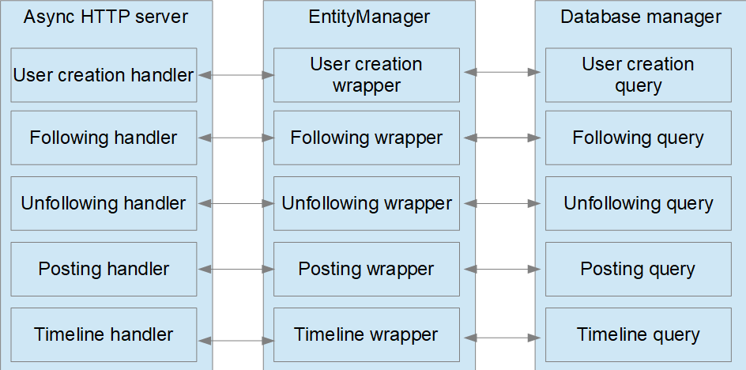

Design
------
This is "messaging system" project.
Structure can be describe by this diagram:



So after application initialization for each request:
- data converted to "inner" entities via handler
- data converted to feed it to database wrapper via entity manager
- (one) SQL query called by database manager 

About design limitations:
- nothing written about user registration/authentification/authorization, so I not implemented it.
  **But it's strongly needed.**
  Now this functionality can be implemented in 3 stages:
  - redesign user creation procedure
  - add user authentification procedure
  - for authorization - compare authentificated UID and requested UID's in request handlers 
-  about scaling - current application can be splitted to 2 parts:
  - database server - can be scaled by partitioning
  - "core" application - doesn't have any state except database state - so it can be horisontally scaled.
  
Dependencies installation
-------------------------
I tested application same on Ubuntu 16.04 (with python-3.6) and Windows 10 (python-3.6). 
There I attached instruction for ubuntu (maybe it'll be good idea to test Debian/RedHat-based distributions too):
```
sudo apt update
yes | sudo apt install postgresql postgresql-contrib python3 python3-pip git
git clone https://github.com/alex4321/particle-test
cd particle-test
pip3 install -r requirements.txt
sudo -u postgres createdb messaging --encoding='utf-8' --locale=en_US.utf8 --template=template0
echo "ALTER USER postgres WITH PASSWORD 'new_password';" | sudo -u postgres psql messaging
```

Now you need to create database:
```
CREATE_DATABASE=`cat messaging/create.sql`
echo "\c messaging" > /tmp/db.sql
echo "$CREATE_DATABASE" >> /tmp/db.sql
cat /tmp/db.sql | sudo -u postgres psql 
```

Testing
-------
Now you can run tests:
```
DB_NAME=messaging DB_USER=postgres DB_PASSWORD=new_password PYTHON=python3 bash test.sh
```

You must see something like next:
```
/home/user/.local/lib/python3.5/site-packages/psycopg2/__init__.py:144: UserWarning: The psycopg2 wheel package will be renamed from release 2.8; in order to keep installing from binary please use "pip install psycopg2-binary" instead. For details see: <http://initd.org/psycopg/docs/install.html#binary-install-from-pypi>.
  """)
======== Running on http://127.0.0.1:8000 ========
(Press CTRL+C to quit)
USER1
Returned by API: 200 {'result': {'uid': 7}, 'success': True}
USER2
Returned by API: 200 {'result': {'uid': 8}, 'success': True}
USER3
Returned by API: 200 {'result': {'uid': 9}, 'success': True}
U1_FOLLOW_U2
Returned by API: 200 {'result': {'follower': {'uid': 7}, 'target': {'uid': 8}}, 'success': True}
U2_POST1
Returned by API: 200 {'result': {'unix_timestamp': 1518636400.544854, 'reply_to_message': None, 'author': {'uid': 8}, 'body': 'Test1', 'id': 1}, 'success': True}
U1_TIMELINE
Returned by API: 200 {'result': [{'unix_timestamp': 1518636400.544854, 'reply_to_message': None, 'author': {'uid': 8}, 'body': 'Test1', 'id': 1}], 'success': True}
U3_POST1
Returned by API: 200 {'result': {'unix_timestamp': 1518636400.587839, 'reply_to_message': None, 'author': {'uid': 9}, 'body': 'Test2', 'id': 2}, 'success': True}
U1_TIMELINE2
Returned by API: 200 {'result': [{'unix_timestamp': 1518636400.544854, 'reply_to_message': None, 'author': {'uid': 8}, 'body': 'Test1', 'id': 1}], 'success': True}
U2_POST2
Returned by API: 200 {'result': {'unix_timestamp': 1518636400.630353, 'reply_to_message': {'unix_timestamp': None, 'reply_to_message': None, 'author': None, 'body': None, 'id': 2}, 'author': {'uid': 8}, 'body': 'Test3', 'id': 3}, 'success': True}
U1_TIMELINE3
Returned by API: 200 {'result': [{'unix_timestamp': 1518636400.544854, 'reply_to_message': None, 'author': {'uid': 8}, 'body': 'Test1', 'id': 1}], 'success': True}
U1_FOLLOW_U3
Returned by API: 200 {'result': {'follower': {'uid': 7}, 'target': {'uid': 9}}, 'success': True}
U1_TIMELINE4
Returned by API: 200 {'result': [{'unix_timestamp': 1518636400.630353, 'reply_to_message': {'unix_timestamp': None, 'reply_to_message': None, 'author': None, 'body': None, 'id': 2}, 'author': {'uid': 8}, 'body': 'Test3', 'id': 3}, {'unix_timestamp': 1518636400.587839, 'reply_to_message': None, 'author': {'uid': 9}, 'body': 'Test2', 'id': 2}, {'unix_timestamp': 1518636400.544854, 'reply_to_message': None, 'author': {'uid': 8}, 'body': 'Test1', 'id': 1}], 'success': True}
U1_TIMELINE4
Returned by API: 200 {'result': [{'unix_timestamp': 1518636400.630353, 'reply_to_message': {'unix_timestamp': None, 'reply_to_message': None, 'author': None, 'body': None, 'id': 2}, 'author': {'uid': 8}, 'body': 'Test3', 'id': 3}], 'success': True}
All tests passed
```

It's meants that:
- server succesfully initialized.
- python test script sucessfully maked test requests and validated output.

API usage
---------
You can see API usage samples in tests.py.
Shortly - we have 4 requests types. Each request return JSON with structure like:
```
{
    "sucess": SuccessFlag,
    "result" HandlerReturnValue
}
``` 
and with status codes:
- 200 for sucess request (sucess=true)
- 500 for failed request (success=false)

And there params/return values description:
- ```POST /user``` - create user. 
    Don't require params (note - we haven't details about registration process).
    Returns dict ```{'uid': uid}```, where uid - integer id
- ```POST /follow``` - user with ```follower``` uid subscribe to ```target```-uid user messages.
   POST params:
   - follower - integer user identifier
   - target - integer user identifier
- ```POST /unfollow``` - user with ```follower``` uid unsubscribe from ```target```-uid user messages.
   POST params:
   - follower - integer user identifier
   - target - integer user identifier
- ```POST /message``` - user with ```author``` uid post message with ```body``` text 
   (optinally - as reply to ```reply_to```-id message).
   POST params:
   - author - integer user identifier
   - body - message text (string)
   - reply_to - if setted - parent message id (integer)
- ```GET /timeline``` - GET request to get user timeline. Params:
   - user - integer user identifier
   - max_messages - maximal timeline size (integer)

TODO
----
- add registration/authentification/authorization functions.
- automate deployment.